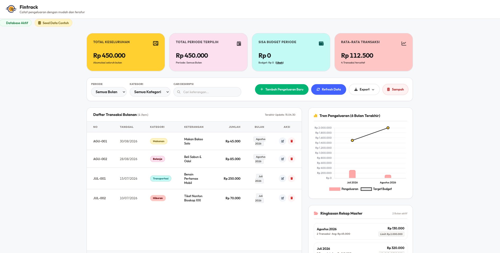
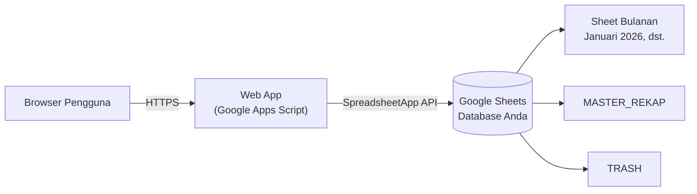

<p align="center">
  
</p>

<h1 align="center">Fintrack</h1>

<p align="center">
  Aplikasi pencatatan keuangan pribadi yang sederhana dan jujur.<br>
  Berjalan sepenuhnya di <b>Google Apps Script</b> + <b>Google Sheets</b> — tanpa server, tanpa instalasi, gratis selamanya.
</p>

<p align="center">
  
  
  
  
</p>

<p align="center">
  <a href="#instalasi--deployment"><b>Mulai Setup →</b></a>
  <a href="https://github.com/Aaksaa/fintrack">Repositori</a>
</p>

---

> *Fintrack is a personal finance tracker that runs entirely on the Google ecosystem — Apps Script as the backend, Google Sheets as the database. Your data stays yours, stored in your own Google Drive.*

---

## Daftar Isi

- [Tentang Fintrack](#tentang-fintrack)
- [Fitur Utama](#fitur-utama)
- [Cara Kerja (Arsitektur)](#cara-kerja-arsitektur)
- [Struktur Data](#struktur-data)
- [Prasyarat](#prasyarat)
- [Instalasi & Deployment](#instalasi--deployment)
- [Panduan Penggunaan](#panduan-penggunaan)
- [Memperbarui Aplikasi](#memperbarui-aplikasi)
- [Troubleshooting](#troubleshooting)
- [Struktur Projek](#struktur-projek)
- [Kontribusi](#kontribusi)
- [Lisensi](#lisensi)
- [Kontak & Tautan](#tautan)

---

## Tentang Fintrack

**Fintrack** adalah aplikasi pencatatan keuangan pribadi yang dirancang dengan satu filosofi sederhana: **data Anda tetap menjadi milik Anda**.

Alih-alih menyimpan data di server pihak ketiga, Fintrack menggunakan **Google Sheets milik Anda sendiri** sebagai database. Seluruh logika aplikasi berjalan di **Google Apps Script** dan disajikan sebagai **Web App** yang bisa diakses dari browser mana pun — desktop maupun ponsel.

| | |
|---|---|
| **Untuk siapa?** | Siapa pun yang ingin mencatat pengeluaran & pemasukan bulanan tanpa aplikasi berbayar atau langganan. |
| **Kenapa Sheets?** | Transparan, bisa diekspor kapan saja, dan tidak ada *vendor lock-in*. |
| **Berapa biayanya?** | Gratis selamanya. Tidak ada server yang perlu dibayar. |
| **Berapa lama setup?** | ±10 menit, cukup 5 langkah. |

---

## Fitur Utama

| Fitur | Deskripsi |
|---|---|
| **Auto-create Sheet** | Menambah transaksi di bulan baru (misal *Maret 2026*)? Sistem otomatis membuat sheet baru, menyusun header, dan menyiapkan formula total di bagian bawah. |
| **Budgeting** | Atur target pengeluaran bulan terpilih melalui tombol **(Ubah)** di card *"Target Budget"*. Jika pengeluaran melebihi limit, badge rekap dan kartu indikator otomatis berubah merah sebagai peringatan. |
| **Trash Bin (Soft Delete)** | Menghapus data tidak membuangnya selamanya — data dipindahkan ke sheet `TRASH` dan bisa dipulihkan kembali lewat tombol **Sampah** di UI utama. |
| **Ekspor CSV & Google Sheet** | Unduh laporan berformat CSV secara lokal, atau langsung lompat ke tab sheet spesifik melalui link ekspor. |
| **Rekap & Visualisasi** | Rencana keuangan, ringkasan kartu, serta grafik tren pengeluaran 6 bulan terakhir yang terisi dinamis dari `MASTER_REKAP`. |

 
## Tangkapan Layar


<p align="center">
  
</p>


---

## Cara Kerja (Arsitektur)

Fintrack tidak membutuhkan server sendiri. Seluruh alur berjalan di infrastruktur Google:



1. **Frontend** (`index.html`) — antarmuka web yang disajikan oleh Apps Script.
2. **Backend** (`backend.gs`) — menangani logika transaksi, budgeting, rekap, dan soft delete.
3. **Database** — Google Sheets Anda sendiri, diakses melalui `SpreadsheetApp`.

---

## Struktur Data

Saat pertama kali dijalankan (atau setelah seed), spreadsheet Anda akan berisi:

| Sheet | Fungsi |
|---|---|
| `Januari 2026`, `Februari 2026`, … | Satu sheet per bulan, berisi transaksi beserta formula total di bagian bawah. Sheet baru dibuat otomatis saat dibutuhkan. |
| `MASTER_REKAP` | Rekapitulasi antar-bulan dan budget bulanan — sumber data grafik tren 6 bulan. |
| `TRASH` | Penampungan sementara data yang dihapus (soft delete), dapat dipulihkan kapan saja. |

---

## Prasyarat

Sebelum memulai, pastikan Anda memiliki:

- [x] Akun Google
- [x] Akses ke [Google Sheets](https://sheets.google.com)
- [x] Akses ke repositori GitHub Fintrack
- [x] Browser modern (Chrome, Firefox, Edge, atau Safari)

---

## Instalasi & Deployment

Cara memasang dan menjalankan Fintrack menggunakan Google Apps Script — dari spreadsheet kosong hingga web app siap pakai.

### 1. Siapkan Google Sheets (Database)

1. Buka [Google Sheets](https://sheets.google.com) dan buat sebuah Spreadsheet baru.
2. Beri nama spreadsheet Anda, misalnya: `Database Fintrack`.
3. Salin **Spreadsheet ID** dari URL browser Anda.

   Format URL:

   ```
   https://docs.google.com/spreadsheets/d/SAMPEL_ID_SPREADSHEET/edit#gid=0
   ```

   Salin bagian `SAMPEL_ID_SPREADSHEET` (string acak panjang berisi huruf dan angka). **Simpan ID ini untuk Langkah 3.**

### 2. Ambil Kode dari GitHub & Pasang di Apps Script

Download atau clone projek dari GitHub — pilih salah satu:

- **Download ZIP:** klik tombol `Code` → `Download ZIP`, lalu ekstrak ke folder lokal.
- **Git Clone:** jalankan perintah berikut di Terminal:

  ```bash
  git clone https://github.com/Aaksaa/fintrack.git
  ```

Kemudian pasang di Apps Script:

1. Pada Google Spreadsheet yang telah Anda buat, klik menu **Extensions → Apps Script** di bagian atas menu bar.
2. Anda akan diarahkan ke editor Google Apps Script.
3. Hapus semua file bawaan (jika ada), atau edit isi file default `backend.gs`.
4. Salin isi kode dari file `backend.gs` (hasil download/clone) ke file `backend.gs` di editor.
5. Buat file HTML baru: klik ikon **+** di sebelah kanan tulisan *"Files"*, pilih **HTML**, lalu beri nama `Index` (Apps Script otomatis membuat file `index.html`).
6. Salin isi kode dari file `index.html` (hasil download/clone) ke file `index.html` di editor.
7. Simpan projek dengan tombol save (ikon disket) atau `Ctrl + S`.

### 3. Konfigurasi SPREADSHEET_ID (Script Properties)

Agar aplikasi terhubung ke Google Sheet yang spesifik:

1. Di bilah menu kiri Apps Script Editor, klik ikon gigi roda **Project Settings**.
2. Gulir ke bawah hingga bagian **Script Properties**.
3. Klik tombol **Add script property**.
4. Masukkan kolom *Property* dengan nama: `SPREADSHEET_ID`
5. Masukkan kolom *Value* dengan ID Spreadsheet yang telah Anda salin di Langkah 1.
6. Klik **Save script properties**.

> **Catatan:** Jika Anda tidak mengatur properti ini, Apps Script secara otomatis akan mencoba menggunakan Spreadsheet yang terikat langsung (*active spreadsheet*).

### 4. Deploy sebagai Web App

1. Klik tombol **Deploy** di bagian kanan atas editor Apps Script, lalu pilih **New deployment**.
2. Klik ikon gigi roda (*Select type*) di samping kiri *"Configuration"*, pilih **Web app**.
3. Isi kolom konfigurasi sebagai berikut:

   | Konfigurasi | Nilai |
   |---|---|
   | **Description** | `Fintrack Deployment v1.0` |
   | **Execute as** | `Me (email-anda@gmail.com)` |
   | **Who has access** | `Anyone` — *diperlukan agar aplikasi web bisa diakses dan berinteraksi lancar dengan backend* |

4. Klik tombol **Deploy**.
5. Google akan meminta izin otorisasi akses spreadsheet: klik **Authorize Access**, pilih akun Google Anda, klik **Advanced** (di bagian bawah kiri), pilih **Go to Fintrack (unsafe)**, lalu klik **Allow**.
6. Setelah deployment sukses, salin **Web app URL** yang muncul (contoh format: `https://script.google.com/macros/s/.../exec`).

   **URL inilah link aplikasi web Fintrack Anda!**

### 5. Isi Data Contoh Pertama Kali (Seed Data)

Aplikasi web Anda akan kosong di awal. Agar Anda langsung dapat melihat visualisasi grafik dan rekap data bulanan:

1. Kembali ke editor Apps Script Anda.
2. Di baris menu atas editor, pilih fungsi `seedInitialData` pada dropdown pilihan fungsi (di sebelah kanan tombol *"Debug"*).
3. Klik tombol **Run** (ikon segitiga/play).
4. Setelah eksekusi sukses, periksa Google Spreadsheet Anda — muncul dua sheet baru bernama **Januari 2026** dan **Februari 2026** berisi data transaksi, beserta sheet **MASTER_REKAP** berisi rekapitulasi data dan budget bulanan.
5. Buka kembali (atau muat ulang) Web app URL Anda. Rencana keuangan, ringkasan kartu, serta grafik tren pengeluaran 6 bulan terakhir akan terisi secara dinamis!

---

## Panduan Penggunaan

| Aktivitas | Cara |
|---|---|
| **Menambah transaksi** | Pilih bulan pada UI, lalu tambahkan transaksi. Jika sheet bulan tersebut belum ada, sistem membuatnya otomatis (Auto-create Sheet). |
| **Mengatur budget** | Klik tombol **(Ubah)** pada card *"Target Budget"* untuk bulan terpilih. Pengeluaran yang melebihi limit ditandai merah otomatis. |
| **Menghapus data** | Data yang dihapus masuk ke sheet `TRASH` (soft delete) — tidak hilang permanen. |
| **Memulihkan data** | Buka tombol **Sampah** di UI utama, lalu pulihkan entri yang diinginkan. |
| **Ekspor laporan** | Unduh CSV secara lokal, atau gunakan link ekspor untuk langsung membuka tab sheet spesifik. |
| **Melihat tren** | Grafik tren pengeluaran 6 bulan terakhir ter-update otomatis dari `MASTER_REKAP`. |

---

## Memperbarui Aplikasi

Setelah Anda mengedit kode (`backend.gs` atau `index.html`):

1. Klik **Deploy → Manage deployments**.
2. Klik ikon pensil (**Edit**) pada deployment aktif.
3. Ubah **Version** menjadi **New version**.
4. Klik **Deploy**.

Web app URL Anda **tetap sama** — tidak perlu membagikan ulang link.

---

## Troubleshooting

| Masalah | Kemungkinan Penyebab | Solusi |
|---|---|---|
| Muncul peringatan *"Go to Fintrack (unsafe)"* saat otorisasi | Aplikasi belum diverifikasi Google | **Normal dan aman** selama Anda mengotorisasi aplikasi yang Anda deploy sendiri. Lanjutkan dengan *Advanced → Allow*. |
| Data tidak muncul di aplikasi | `SPREADSHEET_ID` salah/kosong, atau seed belum dijalankan | Periksa Script Properties (Langkah 3), lalu jalankan `seedInitialData` (Langkah 5). |
| Aplikasi error setelah edit kode | Deployment belum diperbarui | Buat **New version** di *Manage deployments* (lihat [Memperbarui Aplikasi](#memperbarui-aplikasi)). |
| Pengguna lain tidak bisa mengakses | *Who has access* bukan `Anyone` | Deploy ulang dengan **Who has access: Anyone**. |
| Transaksi bulan baru tidak tersimpan | — | Pastikan fitur Auto-create Sheet aktif; sheet bulan baru dibuat otomatis saat transaksi pertama disimpan. |

---

## Struktur Projek

```
fintrack/
├── backend.gs      # Logika backend: transaksi, budgeting, rekap, soft delete, seed data
├── index.html      # Antarmuka web (frontend) yang disajikan Apps Script
└── readme.md       # Dokumentasi ini
```

---

## Kontribusi

Kontribusi selalu diterima! Silakan:

1. **Fork** repositori ini.
2. Buat branch fitur: `git checkout -b feature/nama-fitur`.
3. Commit perubahan Anda: `git commit -m 'feat: menambahkan fitur X'`.
4. Push ke branch: `git push origin feature/nama-fitur`.
5. Ajukan **Pull Request**.

Untuk bug atau usulan fitur, buka [Issues](https://github.com/Aaksaa/fintrack/issues).

---

## Lisensi

© MIT

<!-- Jika projek ingin dibuka lisensinya, tambahkan file LICENSE (misalnya MIT) dan perbarui bagian ini. -->

---

## Tautan

| | |
|---|---|
| Repositori | [github.com/Aaksaa/fintrack](https://github.com/Aaksaa/fintrack) |
| Teknologi | Google Apps Script + Google Sheets |

---
